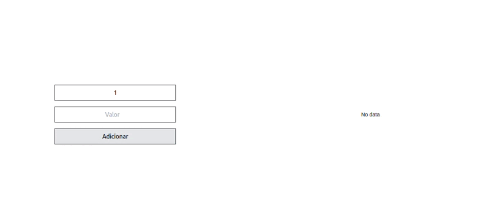

<h1 align="center">React Graphics</h1>

Projeto criado para praticar a biblioteca react-google-charts, responsável por disponibilizar gráficos de maneira prática e de fácil implementação.

<a href="https://brunocabralsilva.github.io/menu/" target ="_blank"><h3 align="center">https://brunocabralsilva.github.io/react-graphics/</h3></a>

